<h1 style="text-align:center">
Maya CommandLauncher Maya 命令启动器
</h1>

这个插件基于以下两款插件的启发进行开发
+ [CommandSearch](http://technicaldirector.nl/projects/command_search/)
+ [quicklauncher](https://github.com/csaez/quicklauncher)

代码结构完全是在 CommandSearch 的源码上进行的修改    
此外 Listary5.0 软件的使用逻辑也启发了我

开发遇到的问题可以参考我的[博客文章](./18de3838.html)

## 安装 

安装步骤和我另一个 [mpdb](https://github.com/FXTD-ODYSSEY/mpdb) 插件一致，步骤如下：

1. 在 Github 上下载发布的插件压缩包 （或者将 release 分支克隆到本地）
2. 将压缩包解压到任意路径上（建议路径保持全英文）(如果是克隆分支的不需要解压操作)
3. 将 install.mel 拖拽到 Maya 的视窗上 

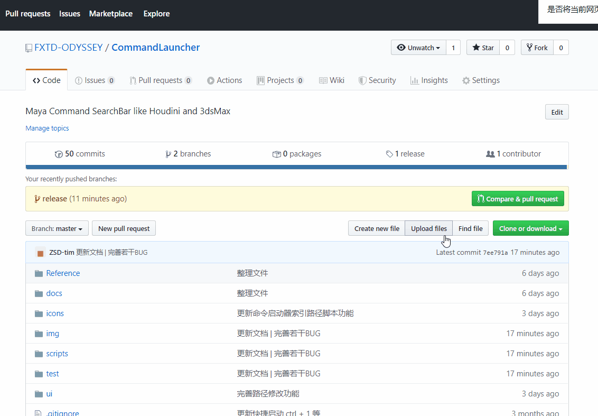

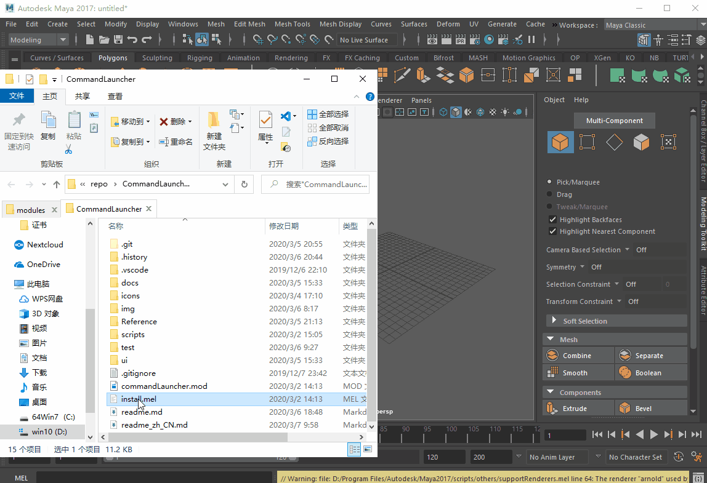

## 使用方法

> &emsp;&emsp;安装完成之后，上面的状态栏会多了一个搜索的图标。     
> &emsp;&emsp;并且在Maya的视窗中点击 Tab 键即可进行命令搜索。     

### 状态栏图标

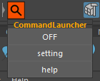

> &emsp;&emsp;点击状态栏图标可以控制启动器的启用状态以及打开启动器的设定窗口。     

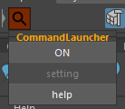

> &emsp;&emsp;点击关闭之后，启动器就会从 Maya 中删除，并且状态栏的图标会变暗提示未启动。     
> &emsp;&emsp;这个设置会记录到设定里面，下次开启 Maya 就不会加载搜索框，导致开启时间增长。     

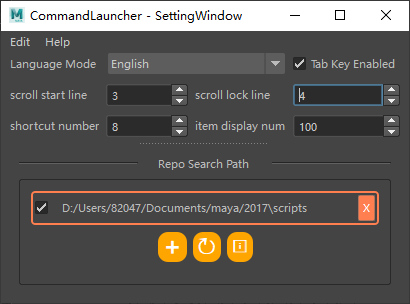

> &emsp;&emsp;点击设定按钮就会弹出设定窗口     

### 搜索使用

> &emsp;&emsp;默认开启之后，在视窗中敲击键盘 Tab 键可以弹出搜索框。     
> &emsp;&emsp;输入关键字即可进行搜索。     

> &emsp;&emsp;搜索得到的结果可以配合键盘进行滚动     
> + 使用 `上下键` 可以浏览结果
> + 使用 `左右键` 可以去到指定按钮和选项按钮
> + 通过 `alt + 数字键` 可以跳到相应的标签的结果
> + 通过 `Ctrl + 数字键` 可以执行相应的标记的结果

### 过滤搜索

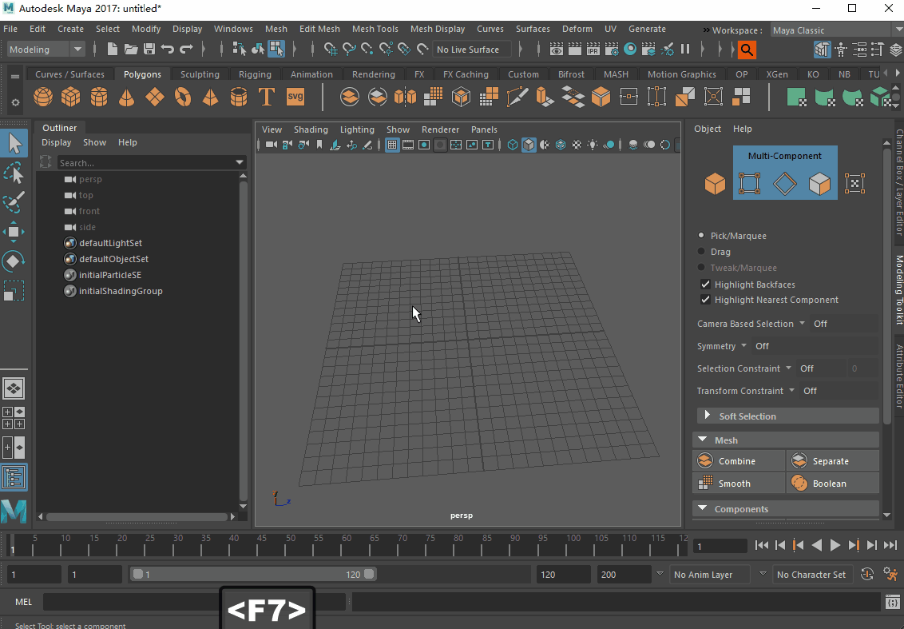

> &emsp;&emsp;通过键盘 `Ctrl + Q W E R T` 可以开启结果过滤模式。     

### 置顶菜单

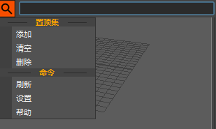

> &emsp;&emsp;搜索框左侧的搜索按钮可以打开置顶菜单。     

> &emsp;&emsp;点击添加，会弹出输入窗口，输入置顶集的名称即可     
> &emsp;&emsp;清空则是清空当前的置顶集     
> &emsp;&emsp;点击删除则会弹出一个下拉菜单窗口，选择要删除的置顶集。     

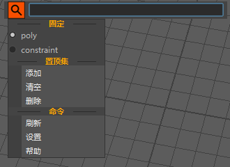

> &emsp;&emsp;创建置顶集之后，当前选中的置顶对象就会存储到当前选择的置顶集当中     

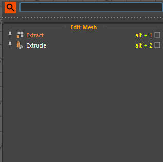

> &emsp;&emsp;默认什么都没有输入的时候就会显示当前的置顶集存储的项来快速调用。     

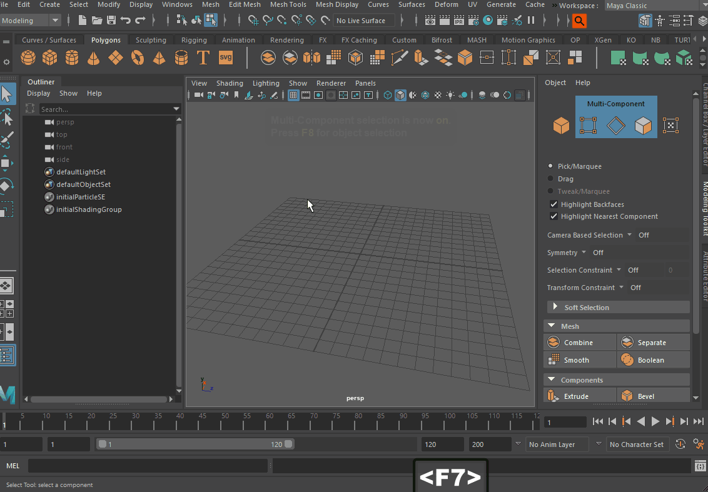

> 通过 ctrl + alt + 数字键 可以快速切换前9个置顶集。

### 设定选项讲解

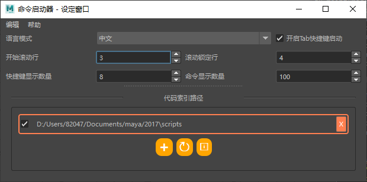

> + 语言模式 - 切换当前插件文字显示的语言
> + 开启Tab快捷键启动 - 用于禁用 Tab 快捷键的注册
> + 开始滚动行 - 上下键移动到几行开始滚动滚动条跟随
> + 滚动锁定行 - 快捷键滚动的时候锁定在滚动的第几行
> + 快捷键显示数量 - 支持显示多少个快捷键触发，只支持 0-9
> + 命令显示数量 - 匹配项显示，太多匹配项生成会拖慢结果显示的速度(搜索卡顿)

---

> &emsp;&emsp;下面是代码路径搜索，默认添加 我的文档 / maya / version / scripts 目录     
> &emsp;&emsp;添加了目录之后点击刷新即可搜索 目录下的 代码文件进行执行。 (Python 和 Mel 均可)      
> &emsp;&emsp;第一个按钮用来添加新的目录      
> &emsp;&emsp;第二按钮用来刷新当前目录的加载      
> &emsp;&emsp;第三个按钮是打开设定存储的文件夹方便手动修改。      

## todolist

- [x] 用i18n替换之前的手动替换语言方式
- [x] 修改 menu 名称
- [x] 添加状态图标到 status line
- [x] 通过多线程优化加载
- [x] 开发一个控制脚本路径导入导出的组件
- [x] 将 quicklauncher 的功能集成
- [x] 添加 scripts 过
- [x] 打开&修改路径 | 打开 setting.json 路径
- [x] 状态图标添加打开设定窗口的按钮
- [x] 导入路径的 label 点击 toggle checkbox 
- [x] 记录状态栏的开启关闭状态到 json 里面
- [x] 修改帮助文档打开 到 github
- [x] 添加帮助按钮到 status 图标上
- [x] 改良 pin 的菜单触发机制 | 修改触发 input dialog
- [x] 修复置顶集无法切换的问题
- [x] 完善文章总结&md说明
